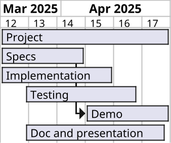

# Introduction To Robotics 2025 Project 

## Goal

Implement an autonomous behavior for the Create3 robot.

### Minimum Requirements

**The requirements below are necessary, but can also be sufficient if enough care is taken in their implementation and presentation**

- The robot shall 
    - undock
    - navigate in the class for "some" time
    - find its way back and dock
- At every moment when undocked, one shall be able to stop the robot and take back manual control 
    - hint: use twist_mux package

## Team Specific Requirements

- Obstacle avoidance: implement smart strategy using all sensors 
- Use of simulator(s) for prototyping and testing
    - create and run scenarios with turtlesim and/or gazebo 
- Speed: reach a spot and come back fast
- Mapping: produce some map of the robot expedition
- External device: embark and interface a raspberry pi or other 
- ?

## Tasks and Planning

- [ ] Specifications: write down expected features and behaviors 
- [ ] Implementation
- [ ] Testing: design simple scenarios testing individual or intermediate features
    - [ ] Test1 (example): test FSM on turtlesim
    - [ ] Test2 (example): test robot avoiding chair 
    - [ ] etc
- [ ] Demo
- [ ] Documentation and presentation

### Tentative Planning

### Organization

Work in team:
- Assign roles and tasks 
    - project manager
    - code review 
    - tester 
    - documenter 
    - etc
- Communicate 
    - Progress reports
    - Directions

